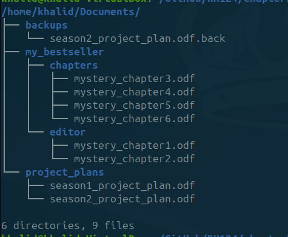

RH124 Chapter 3: Manage Files from the Command Line
Project Overview

This project documents my hands-on practice from RH124 Chapter 3, which focuses on managing files and directories from the Linux command line.

The lab was completed in an Ubuntu virtual machine using Bash commands.

Objectives

The objectives of this project were to practice:

Creating files and directories
Navigating the Linux file system
Using absolute and relative paths
Copying and moving files
Removing files and directories
Using brace expansion and wildcards
Creating directory hierarchies
Creating and verifying hard links
Using command continuation with a backslash
Commands Practiced

The main commands used in this project include:

pwd
ls
cd
mkdir
touch
cp
mv
rm
rmdir
ln

I also practiced shell features such as:

{1..8}
{1,2}
*
[56]
~
..
Project Files
chapter3-manage-files/
├── README.md
├── commands.md
├── lessons-learned.md
├── setup.sh
└── screenshots/
Skills Demonstrated
Linux file and directory management
Bash command-line navigation
Shell expansion and pattern matching
File organization
Basic troubleshooting
Hard-link creation and verification
Lab Completion

I first completed the lab with guidance and then repeated it independently without using the provided solution.

During the second attempt, I identified and corrected command errors while completing the required directory and file structur.
## Screenshots

### Directory Structure (tree)

### Detailed File Information (ls -lR)

